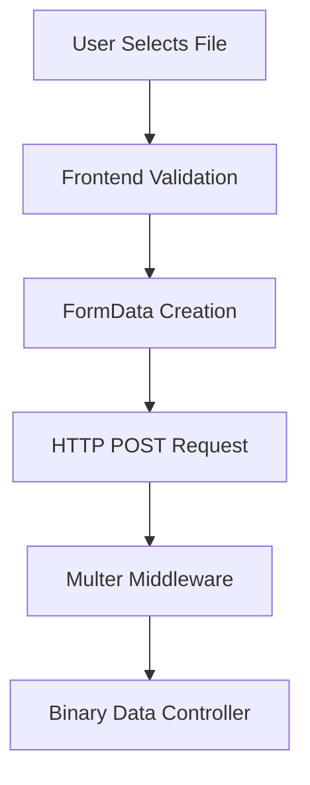
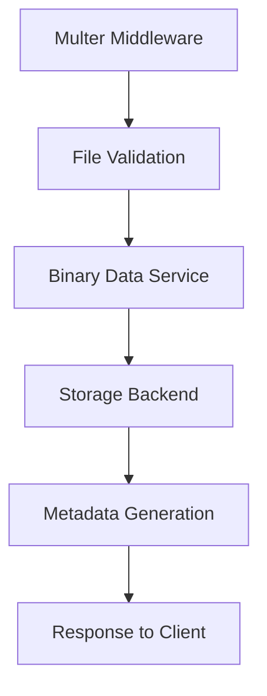
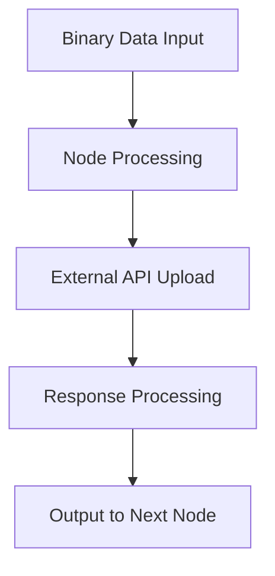

# File Upload Endpoints & Infrastructure Analysis

## Executive Summary

This research provides a comprehensive mapping of all file upload functionality within the n8n monorepo. The analysis reveals a sophisticated multi-layered file upload infrastructure with robust security, storage management, and integration capabilities.

## 🎯 Key Findings

- **Primary Upload Endpoint**: `/binary-data/upload` (REST API with multer middleware)
- **Form Processing**: Webhook-based form submissions with multipart/form-data support
- **Storage Architecture**: Pluggable binary data service supporting filesystem and cloud storage
- **Security Framework**: MIME type validation, file size limits, path traversal protection
- **Frontend Integration**: Vue.js components for file uploads with drag-and-drop support

---

## 📊 Complete File Upload Infrastructure Map

### 1. Core Upload Endpoints & Routes

#### Primary Binary Data Controller
- **Location**: `/packages/cli/src/controllers/binary-data.controller.ts`
- **Base Route**: `/binary-data`
- **Key Endpoints**:
  - `POST /binary-data/upload` - Primary file upload endpoint
  - `GET /binary-data/:id` - File retrieval with query parameters
  - `GET /binary-data/signed` - Signed URL access (no auth required)
  - `DELETE /binary-data/:id` - File deletion
  - `GET /binary-data/:id/download` - Direct file download

#### Advanced Binary Operations
- **Bulk Export**: `POST /binary-data/bulk/export` (Enterprise)
- **Bulk Import**: `POST /binary-data/bulk/import` (Enterprise) 
- **Cross-Instance Transfer**: `POST /binary-data/migrate/transfer` (Enterprise)
- **Integrity Validation**: `POST /binary-data/validate/integrity`
- **Orphaned Cleanup**: `POST /binary-data/cleanup/orphaned` (Enterprise)
- **Search**: `POST /binary-data/search`
- **Workflow Packaging**: `POST /binary-data/workflow/package` (Enterprise)
- **Operation Progress**: `GET /binary-data/operations/:operationId/progress`

### 2. Form Upload Infrastructure

#### Webhook Form Processing
- **Location**: `/packages/cli/src/webhooks/webhook-form-data.ts`
- **Parser**: `createMultiFormDataParser()` using formidable library
- **Configuration**: Max file size configurable via `formDataFileSizeMax`

#### Form Node Implementation
- **Location**: `/packages/nodes-base/nodes/Form/`
- **Components**:
  - `FormTrigger.node.ts` - Form trigger node
  - `Form.node.ts` - Form processing node
  - `utils/utils.ts` - Form utilities and file handling

---

## 🛠 Technical Architecture

### Upload Libraries & Dependencies

#### Backend Dependencies
```json
{
  "multer": "^1.4.4",           // Primary upload middleware
  "formidable": "3.5.4",        // Multipart form parser
  "@types/formidable": "^3.4.5" // Type definitions
}
```

#### Core Upload Configuration
```typescript
// Multer configuration in binary-data.controller.ts
const upload = multer({
  storage: multer.memoryStorage(),
  limits: {
    fileSize: 100 * 1024 * 1024, // 100MB limit
    files: 1, // Only one file at a time
  },
});
```

### Storage Architecture

#### Binary Data Service
- **Location**: `/packages/cli/src/services/binary-data.service.ts`
- **Features**:
  - Pluggable storage backends (filesystem, S3, etc.)
  - Integrity checksums (SHA-256)
  - Metadata management
  - Stream-based processing for large files

#### Storage Modes
- `filesystem` - Local filesystem storage
- `filesystem-v2` - Enhanced filesystem storage
- `s3` - AWS S3 compatible storage
- `default` - Default storage mode

### Security Framework

#### File Validation
```typescript
// Security validation from binary-data.service.ts
const dangerousMimeTypes = [
  'application/x-executable',
  'application/x-msdownload', 
  'application/x-msdos-program',
  'text/x-script',
];

// Path traversal protection
if (fileName && (fileName.includes('..') || fileName.includes('/'))) {
  throw new ApplicationError('Invalid file name - path traversal detected');
}
```

#### Size Limits & Configuration
- **Default Size Limit**: 100MB per file
- **Configurable**: Via `formDataFileSizeMax` setting
- **Stream Processing**: For files exceeding memory limits

---

## 🎨 Frontend Upload Components

### Chat Upload Interface
- **Location**: `/packages/frontend/@n8n/chat/src/components/Input.vue`
- **Features**:
  - Drag-and-drop file upload
  - Multiple file selection
  - File type restrictions
  - Upload progress indicators

#### Chat Upload Implementation
```typescript
// File upload configuration
const isFileUploadAllowed = computed(() => unref(options.allowFileUploads) === true);
const allowedFileTypes = computed(() => unref(options.allowedFilesMimeTypes));

// File dialog integration
const { open: openFileDialog, reset: resetFileDialog, onChange } = useFileDialog({
  multiple: true,
  reset: false,
});
```

### Form Upload Fields
- **Location**: `/packages/nodes-base/nodes/Form/utils/utils.ts`
- **Field Types**:
  - Single file upload
  - Multiple file upload
  - File type restrictions
  - Accept attributes

```typescript
// Form file field configuration
if (fieldType === 'file') {
  input.isFileInput = true;
  input.acceptFileTypes = field.acceptFileTypes;
  input.multipleFiles = field.multipleFiles ? 'multiple' : '';
}
```

---

## 🔌 Node Integration Patterns

### File Upload Nodes Examples

#### Google Drive Upload
- **Location**: `/packages/nodes-base/nodes/Google/Drive/v2/actions/file/upload.operation.ts`
- **Features**:
  - Binary data input field selection
  - Resumable uploads for large files
  - 2MB chunk processing
  - MIME type detection

#### Slack File Upload  
- **Location**: `/packages/nodes-base/nodes/Slack/V2/FileDescription.ts`
- **API Flow**:
  1. Get upload URL from Slack API
  2. Upload file to provided URL
  3. Complete upload notification

### Binary Data Processing Pipeline

#### File Processing Flow
```typescript
// From Form utils - file processing
for (const key of Object.keys(files)) {
  const processFiles: MultiPartFormData.File[] = [];
  let multiFile = false;
  const filesInput = files[key] as MultiPartFormData.File[] | MultiPartFormData.File;

  // Process single or multiple files
  if (Array.isArray(filesInput)) {
    processFiles.push.apply(processFiles, filesInput);
    multiFile = true;
  } else {
    processFiles.push(filesInput);
  }

  // Convert to binary data format
  for (const file of processFiles) {
    returnItem.binary![binaryPropertyName] = await context.nodeHelpers.copyBinaryFile(
      file.filepath,
      file.originalFilename ?? file.newFilename,
      file.mimetype,
    );
  }
}
```

---

## 🛡️ Security Analysis

### Current Security Measures

#### Input Validation
- **MIME Type Filtering**: Blocks executable file types
- **File Name Sanitization**: Prevents path traversal attacks
- **Size Limits**: Prevents DoS via large files
- **Extension Validation**: Based on file extension parsing

#### Access Control
- **Signed URLs**: For secure file access without authentication
- **Binary Data ID Validation**: Structured ID format validation
- **Storage Mode Validation**: Prevents unauthorized storage access

### Security Recommendations

#### Additional Protections Needed
1. **Content-Based Validation**: Verify file contents match declared MIME type
2. **Virus Scanning**: Integrate with antivirus solutions
3. **Rate Limiting**: Per-user upload rate limits
4. **Content Scanning**: Check for sensitive data in uploads

---

## 📡 API Documentation

### Binary Data Upload Endpoint

#### POST /binary-data/upload

**Request Format**:
```http
POST /binary-data/upload
Content-Type: multipart/form-data

--boundary
Content-Disposition: form-data; name="file"; filename="example.pdf"
Content-Type: application/pdf

[binary data]
--boundary
Content-Disposition: form-data; name="fileName"

custom-name.pdf
--boundary
Content-Disposition: form-data; name="workflowId"

workflow_123
--boundary--
```

**Response Format**:
```json
{
  "success": true,
  "data": {
    "id": "filesystem:workflow_123/execution_456/binary_789",
    "fileName": "custom-name.pdf",
    "mimeType": "application/pdf", 
    "fileSize": 1024768,
    "checksum": "sha256_hash_here",
    "uploadedAt": "2024-01-08T12:00:00Z"
  }
}
```

**Error Responses**:
- `400` - Invalid file or missing data
- `413` - File too large (>100MB)
- `415` - Unsupported file type

### File Retrieval Endpoints

#### GET /binary-data/:id
**Query Parameters**:
- `action`: `view` or `download`
- `fileName`: Override filename
- `mimeType`: Override MIME type

#### GET /binary-data/signed
**Query Parameters**:
- `token`: Signed access token

---

## 🚀 Integration Recommendations for Custom Nodes

### Best Practices

#### 1. Binary Data Input Field Pattern
```typescript
{
  displayName: 'Input Data Field Name',
  name: 'inputDataFieldName', 
  type: 'string',
  default: 'data',
  required: true,
  hint: 'The name of the input field containing the binary file data',
}
```

#### 2. File Processing Pattern
```typescript
const { contentLength, fileContent, originalFilename, mimeType } = 
  await getItemBinaryData.call(this, inputDataFieldName, i);

// Handle both Buffer and Stream content
if (Buffer.isBuffer(fileContent)) {
  // Direct upload for small files
} else {
  // Chunked upload for large files/streams
}
```

#### 3. Security Validation
```typescript
// Validate file type
const allowedTypes = ['image/jpeg', 'image/png', 'application/pdf'];
if (!allowedTypes.includes(mimeType)) {
  throw new NodeOperationError(this.getNode(), 'Unsupported file type');
}

// Validate file size
if (contentLength > MAX_FILE_SIZE) {
  throw new NodeOperationError(this.getNode(), 'File too large');
}
```

### Custom Node Upload Template

```typescript
export async function execute(this: IExecuteFunctions, i: number): Promise<INodeExecutionData[]> {
  const inputDataFieldName = this.getNodeParameter('inputDataFieldName', i) as string;
  
  // Get binary data
  const binaryData = this.helpers.getBinaryData(i, inputDataFieldName);
  const fileBuffer = await this.helpers.getBinaryDataBuffer(i, inputDataFieldName);
  
  // Process upload
  const uploadResult = await uploadToService(fileBuffer, {
    filename: binaryData.fileName,
    mimeType: binaryData.mimeType,
  });
  
  return [{
    json: uploadResult,
    binary: { [inputDataFieldName]: binaryData }
  }];
}
```

---

## 📋 File Upload Flow Summary

### 1. Frontend Upload Flow


### 2. Backend Processing Flow  


### 3. Node Integration Flow


---

## 🔍 Testing Infrastructure

### Test Coverage Areas

#### Upload Controller Tests
- **Location**: `/packages/cli/src/controllers/__tests__/binary-data.controller.test.ts`
- **Coverage**: Endpoint testing, error handling, security validation

#### Form Upload Tests  
- **Location**: `/packages/cli/src/webhooks/__tests__/webhook-form-data.test.ts`
- **Coverage**: Multipart parsing, file processing, error conditions

#### Node Upload Tests
- **Location**: `/packages/nodes-base/nodes/Slack/test/v2/node/file/upload.test.ts` 
- **Coverage**: Node execution, API integration, binary data handling

---

## 📈 Conclusion & Recommendations

### Current State Assessment
n8n has a **comprehensive and well-architected** file upload infrastructure that provides:

✅ **Robust Security**: MIME type validation, size limits, path traversal protection  
✅ **Scalable Architecture**: Pluggable storage backends, stream processing  
✅ **Developer-Friendly**: Clear patterns for node integration  
✅ **Enterprise Features**: Bulk operations, cross-instance transfer, integrity validation  

### Areas for Enhancement

#### 1. Security Hardening
- Implement content-based file type validation
- Add virus scanning integration hooks
- Enhanced rate limiting per user/workflow

#### 2. Performance Optimization
- Implement upload progress tracking
- Add resume capability for interrupted uploads
- Optimize chunked upload algorithms

#### 3. Developer Experience
- Enhanced error messages with specific validation failures
- Upload progress callbacks for custom nodes
- Better documentation for complex upload scenarios

### Custom Node Integration Path
For implementing custom node file uploads:

1. **Follow Binary Data Patterns**: Use `getItemBinaryData()` helper
2. **Implement Security Validation**: File type, size, and content checks  
3. **Handle Both Buffer/Stream**: Support small and large file processing
4. **Use Chunked Uploads**: For large files to external services
5. **Provide Progress Feedback**: Keep users informed during long uploads

The existing infrastructure provides excellent foundations for secure, scalable file upload functionality across the n8n ecosystem.